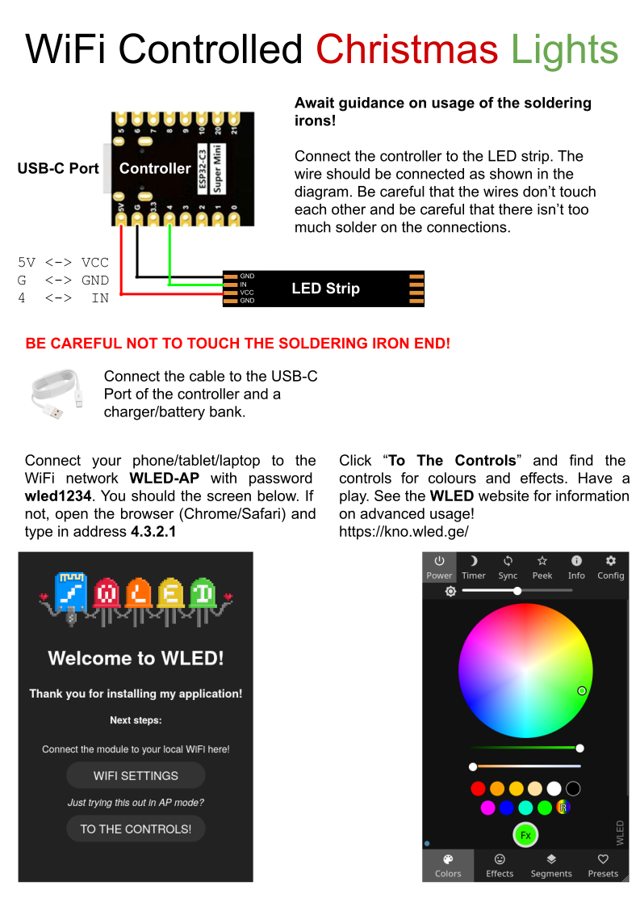
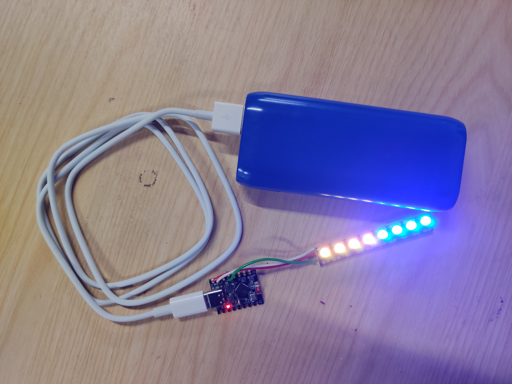

# WLED ESP32 C3 KIT

Idea for an easy to build WiFi controlled LED kit for Leigh Hackspace Christmas open night. Total cost approximately £2 per kit when bulk buying the components.

- Pre-built firmware (including bootloader) for ESP32-C3.
- Flash utility `flash.sh`.
- Instructions on assembling a kit.

## Kit Instructions

## Completed Kit (powered by battery bank)

